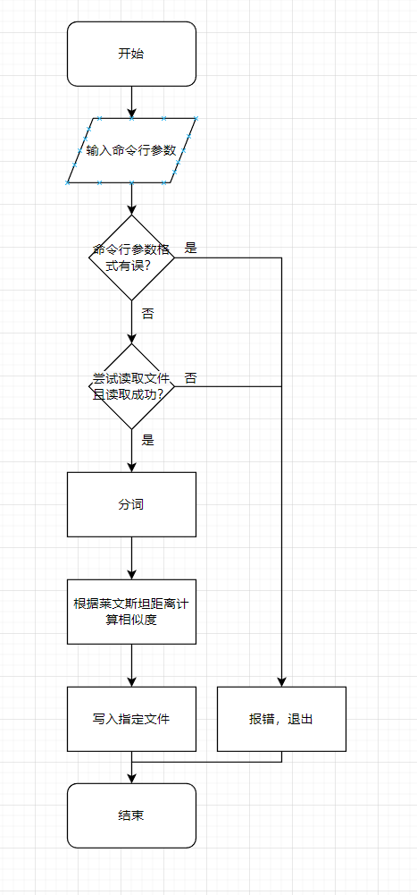
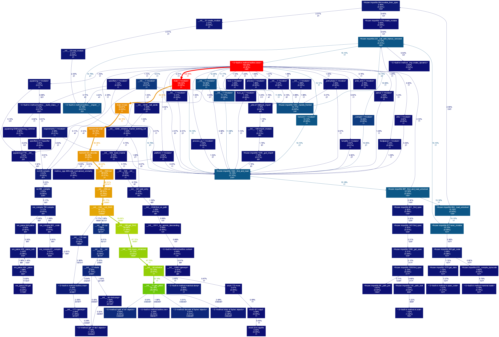
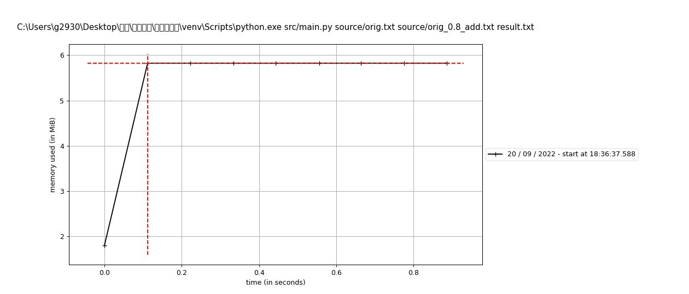
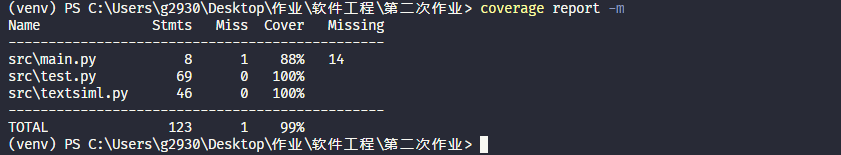

# 第一次个人编程作业

- [第一次个人编程作业](#第一次个人编程作业)
  - [Github 仓库代码连接](#github-仓库代码连接)
  - [PSP](#psp)
  - [设计与实现](#设计与实现)
    - [设计](#设计)
  - [性能改进](#性能改进)
    - [改进对比](#改进对比)
    - [改进思路](#改进思路)
    - [性能分析](#性能分析)
  - [单元测试](#单元测试)
  - [异常处理](#异常处理)
    - [传入参数异常](#传入参数异常)
    - [文件路径异常](#文件路径异常)
  - [结语](#结语)

## Github 仓库代码连接

<https://github.com/Akimitsu333/3120005129/tree/main/src>

## PSP

|PSP2.1|Personal Software Process Stages|预估耗时（分钟）|实际耗时（分钟）|
|:--|:--|:--|:--|
|Planning|计划|-|-|
|· Estimate|· 估计这个任务需要多少时间|420|1408|
|Development|开发|-|-|
|· Analysis|· 需求分析 （包括学习新技术）|120|240|
|· Design Spec|· 生成设计文档|30|3.6|
|· Design Review|· 设计复审|10|300|
|· Coding Standard|· 代码规范 （为目前的开发制定合适的规范）|10|30|
|· Design|· 具体设计|30|2|
|· Coding|· 具体编码|60|49.4|
|· Code Review|· 代码复审|10|420|
|· Test|· 测试（自我测试，修改代码，提交修改）|120|240|
|Reporting|报告|-|-|
|· Test Repor|· 测试报告|60|120|
|· Size Measurement|· 计算工作量|10|2|
|· Postmortem & Process Improvement Plan|· 事后总结，并提出过程改进计划|10|1|
||合计|470|1408|

## 设计与实现

### 设计

- 总体设计：语言采用 Python，执行流程如 流程图 所示。
- 模块：
  - 模块 textsiml 为核心模块，总计有初始化、获取路径、读入文件、写入文件、计算、启动六个函数，功能如其名。
  - 模块 main 提供入口函数 main。
  - 模块 test 为单元测试模块，使用 Python 标准库里的 unittest 框架，对模块 textsiml 及 main 里的每个函数进行了测试。
- 关键算法：
  - 库 jieba 用于中文分词，函数 lcut 将字符串划分后返回包含所有分词的列表。
  - 库 Levenshtein 用于计算相似度，函数 ratio 能根据输入列表变量中的词及顺序，以莱文斯坦距离计算浮点数相似度并返回值。
- 流程图：
  

## 性能改进

### 改进对比

在`commit 953e5dbf044189d399dac423e8ff6b2ff4d1c4b8`中，我的分词方法为以字符分词、相似度计算方法为动态规划的莱文斯坦距离算法。显而易见的，我的执行时间远远超出 5s，而接近 1min。单单执行时间就远超当前版本。

### 改进思路

既然手撸代码效率低，那就结合前人开源的智慧。Python 在数据挖掘方面有很多应用，相比相关工具库也很多，然后我就用 jieba 和 Levenshtein 库的函数代替了手撸代码，效率提升的很明显。

### 性能分析

以`source/orig.txt`和`source/orig_0.8_dis_add.txt`为操作对象，进行相似度计算，并分析性能。

- 运行时间：1.277 s
- 消耗最大的函数：`textsiml:64:calculate`时间消耗最大，占83.86%, 该函数中对`lcut`函数的调用消耗最大。
- 性能分析图：
  

- 运行内存：5.75 MiB
- 性能分析图：
  

## 单元测试

- 代码覆盖率：99%
  - 计算工具：coverage
  - 输出截图：
    

- 测试结果：OK

  ```bash
  ......
  ----------------------------------------------------------------------
  Ran 12 tests in 1.812s

  OK
  ```

- 思路：模拟特定的前置条件（如路径变量、传入参数等）, 对模块的每个函数返回结果/是否报错进行比较
- 代码示例：例如`test`模块中的`test_init`模块，用来测试`textsiml`的初始化是否正常，代码如下：

  ```python

  def test_init(self):
      t1 = textsiml.TextSiml()
      self.assertEqual(t1.paths, None)
      self.assertEqual(t1.strs, None)
      self.assertEqual(t1.result, None)

  ```

## 异常处理

### 传入参数异常

在`textsiml`模块中的`get_path`函数中，会判断传入参数是否为三个。若不为三个，则抛出错误。代码如下：

```python

if len(sys.argv) != 4:
    raise Exception(
        "Format error! Please enter in the following format: \n\tpython main.py [原文文件] [抄袭版论文的文件] [答案文件]"
    )
    
```

单元测试有`test`模块的`test_get_path_1` `test_get_path_2` `test_get_path_3`函数，以函数`test_get_path_2`为例，对应了参数个数少于三个的情况，代码如下：

```python

t1 = textsiml.TextSiml()
sys.argv = ["aaa"]  # 模拟错误的命令行参数
with self.assertRaises(Exception) as cm:  # 参数格式错误会报错
    t1.get_path()
self.assertIsNotNone(cm.exception)  # 判断是否有报错

```

### 文件路径异常

在`textsiml`模块中的`read_file`函数中，会判断上一步得到的路径参数对应的文件是否存在且能读/写。若不能，则报错。代码如下：

```python

try:  # 尝试能否操作所有路径对应的文件
    with open(self.paths[0], mode="r", encoding="utf-8") as f:
        orig_str = f.read()
    with open(self.paths[1], mode="r", encoding="utf-8") as f:
        siml_str = f.read()
    with open(self.paths[2], mode="w", encoding="utf-8") as f:
        pass
except IOError:
    raise IOError("Error opening file!Try again!")

```

单元测试有`test`模块的`test_read_file_1` `test_read_file_2` `test_read_file_3` `test_read_file_4`函数，以函数 `test_read_file_3`为例，对应了抄袭文件不存在、不可读的情况，代码如下：

```python

t1 = textsiml.TextSiml()
t1.paths = (
    "source/orig.txt",
    "source/bbb",
    "result.txt",
)
with self.assertRaises(IOError) as cm:
    t1.read_file()
self.assertIsNotNone(cm.exception)  # 文件不存在，会报错

```

## 结语

🍭~
